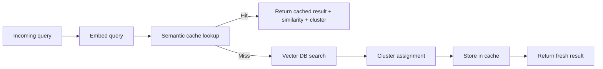

# semantic-search-cache

Lightweight semantic retrieval cache built with `FastAPI`, embedding-based similarity search, fuzzy clustering, and a reusable cache layer for repeated queries.

## What It Does

This project sits in front of a vector-search flow and checks whether an incoming query is semantically close enough to a previous one to reuse the earlier result.

If the query is similar:

- return a cache hit
- surface the matched historical query
- include the similarity score and dominant cluster

If the query is new:

- run vector search
- infer the dominant cluster
- store the result for future reuse

## Flow



## Stack

- `FastAPI` for the API surface
- embedding model wrapper for document and query vectors
- vector database for nearest-neighbor search
- fuzzy clustering for dominant-cluster tagging
- semantic cache with similarity-threshold matching

## API

### `POST /query`

```json
{
  "query": "find customers with rising spend variance"
}
```

Returns:

- whether the request was a cache hit
- the matched prior query if one exists
- similarity score
- nearest search result
- dominant cluster

### `GET /cache/stats`

Returns current cache statistics.

### `DELETE /cache`

Clears the semantic cache.

## Project Layout

| Path | Purpose |
| --- | --- |
| `api/main.py` | FastAPI app and request routing |
| `embeddings/embedder.py` | Query/document embedding generation |
| `vector_store/` | Vector database implementation |
| `clustering/` | Fuzzy clustering logic |
| `cache/` | Semantic cache implementation |
| `data/` | Dataset loading utilities |

## Run Locally

```bash
python -m venv venv
venv\Scripts\activate
pip install -r requirements.txt
uvicorn api.main:app --reload
```

Then open:

```text
http://127.0.0.1:8000/docs
```

## Why It Matters

This repo is a nice entry point into the kind of infrastructure work I enjoy:

- reducing repeated compute
- making search systems feel faster
- building smarter retrieval paths instead of just bigger ones
